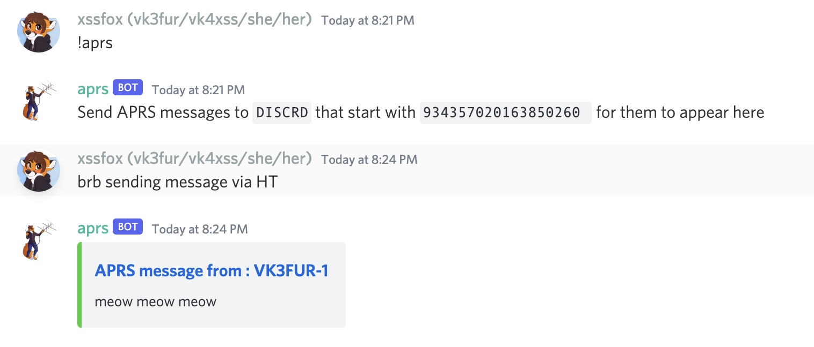

Discord APRS bot
==

Add the discord bot to your server with this [link]( https://discord.com/api/oauth2/authorize?client_id=934322104025907231&permissions=19456&scope=bot).

## Using
Send APRS messages to `DISCORD` prefixed with the channel id. You can get the channel ID by doing `!aprs`.



## Some notes of privacy
APRS is unencrypted, and basically unauthenicated. Keep this in mind. Best practice is to limit the bot to a single channel specific for APRS messages.

## Building / Running
You shouldn't need to run your own bot but if you want to the easiest way is using docker

```sh
docker build -t aprsdiscord .
docker run -e CALLSIGN=YOUR_CALLSIGN -e DISCORD_TOKEN=BOT_TOKEN -e SERVER_NAME=APRS_SERVER_NAME aprsdiscord
```

DO NOT USE `DISCORD` as your `SERVER_NAME`!!!